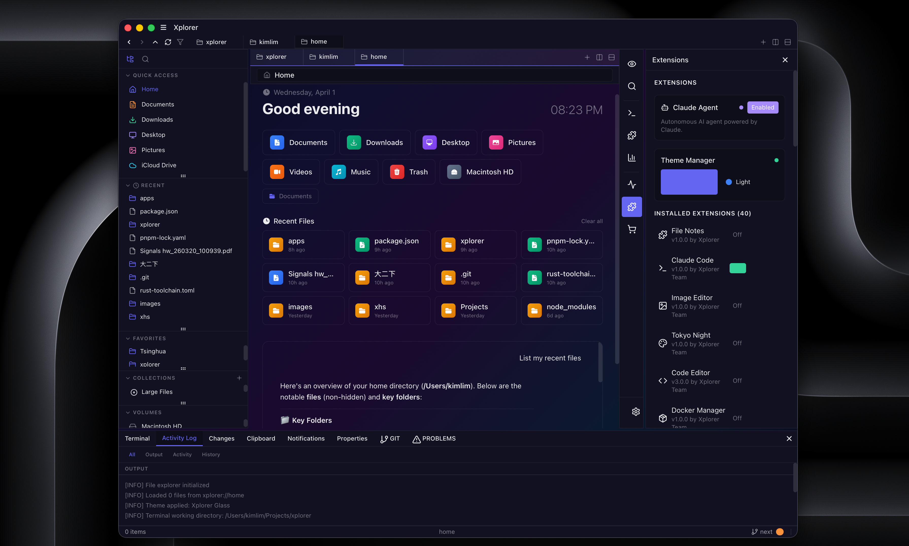
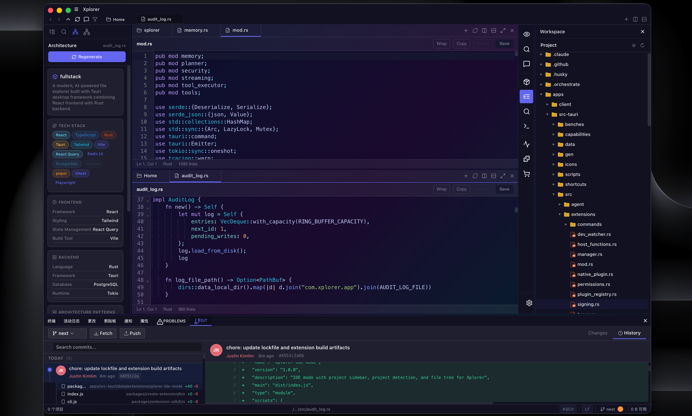
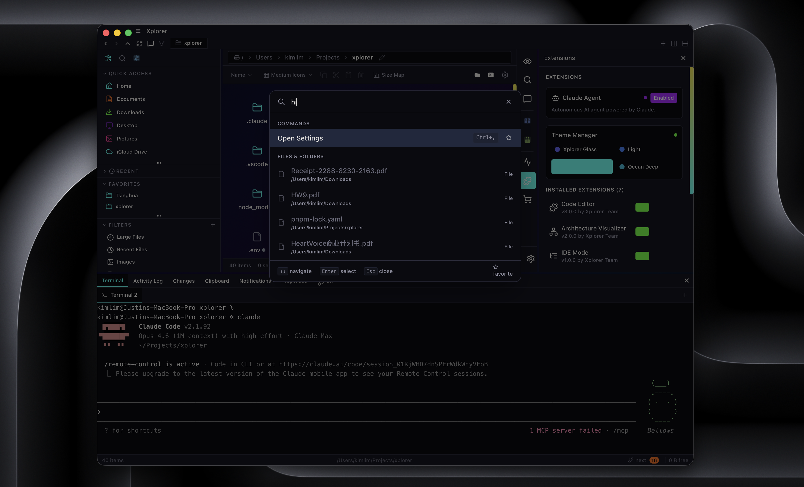

<div align="center">


# Wisp

**A modern, AI-powered file manager built with Rust and React.**

Cross-platform. AI-integrated. Extensible. One app for all your files.

[](https://github.com/kimlimjustin/xplorer/blob/next/LICENSE) [](https://github.com/kimlimjustin/xplorer/releases) [](https://github.com/kimlimjustin/xplorer/stargazers)
[](https://github.com/kimlimjustin/xplorer/releases)[](https://github.com/kimlimjustin/xplorer/releases)[](https://github.com/kimlimjustin/xplorer/releases)

[Website](https://xplorer.space) | [Documentation](https://xplorer.space/docs) | [Discussions](https://github.com/kimlimjustin/xplorer/discussions)

</div>

---

<div align="center">

</div>

## Why Wisp?

Most file managers haven't changed in decades. Wisp is a ground-up rethink: a Tauri 2 desktop app with a Rust backend for speed and a React frontend for flexibility. It ships with AI chat, Git integration, an extension marketplace, and themeable UI out of the box.

> **Note:** This is the `next` branch -- a full rewrite using Tauri 2, React 18, and a new extension system. Not yet production-ready, but actively developed. Feedback welcome!

## Features

<table>
<tr>
<td width="50%">

**File Management**
- Cross-platform: Windows, macOS, Linux
- 6 view modes: Grid, List, Details, Column, Gallery, Tree
- Hardware-accelerated file operations (memory-mapped I/O, parallel chunked transfers)
- Archive support: ZIP, TAR, GZ, BZ2, XZ with password protection
- Multi-tab browsing, split panes, session persistence

</td>
<td width="50%">

**AI Integration**
- Connect any AI provider through API (OpenAI, Anthropic, Google, DeepSeek, Mistral, Ollama)
- Natural language, fuzzy, and semantic file search
- AI chat with full file context awareness
- Agentic file operations and smart categorization

</td>
</tr>
<tr>
<td width="50%">

**Developer Tools**
- Full Git integration: branches, staging, commits, diffs, blame, stash
- Integrated terminal with SSH remote browsing
- Rich file preview: code (syntax highlighted), Markdown, PDF, Word, spreadsheets, audio, video
- Command palette and configurable keyboard shortcuts

</td>
<td width="50%">

**Extensibility**
- Extension marketplace at [xplorer.space](https://xplorer.space)
- Git UI, SSH manager, Docker, Google Drive, code editor, image editor, file hasher, and more
- Themes: Tokyo Night, Dracula, Nord, Cyberpunk, Ocean Deep
- Sandboxed runtime with public SDK — build and publish your own

</td>
</tr>
</table>

## Use Cases

### For Developers
Split-pane file browsing with integrated Git status, terminal, and code editor. Stage commits, view diffs, and manage branches without leaving the file manager.



### For Researchers and Students
AI chat that understands your files. Ask questions about documents, get summaries, and search by meaning — not just filename.


### For Power Users
Command palette, vim keybindings, custom keyboard shortcuts, and per-folder view settings. Six view modes, smart search with filters, and bulk file operations.



## Screenshots

<div align="center">
<table>
<tr>
<td></td>
<td></td>
</tr>
<tr>
<td></td>
<td></td>
</tr>
</table>
</div>

## Installation

Download the latest release for your platform from the [Releases page](https://github.com/kimlimjustin/xplorer/releases).

| Platform | Format |
|---|---|
| Windows | `.msi` / `.exe` |
| macOS | `.dmg` |
| Linux | `.deb` / `.AppImage` |

## Getting Started (Development)

### Prerequisites

- **Node.js** 20+
- **pnpm** 10+
- **Rust** (latest stable via [rustup](https://rustup.rs))

### Setup

```bash
git clone https://github.com/kimlimjustin/xplorer.git -b next
cd wisp
pnpm install
pnpm dev:app
```

This starts the React frontend and Tauri backend. The app window will open automatically.

> To run the full stack including the [marketplace web server](https://xplorer.space), use `pnpm dev` (requires local PostgreSQL via `pnpm run marketplace:db`).

### Build and Test

```bash
pnpm build              # Production build
pnpm test               # Frontend unit tests (Vitest)
pnpm run test:tauri      # Rust backend tests
```

## Architecture

```
wisp/
├── apps/
│   ├── client/           # React 18 + TypeScript + Vite frontend
│   ├── src-tauri/        # Rust backend (Tauri 2, Tokio, Rayon)
│   └── web/              # Next.js marketplace (Prisma, Stripe)
├── packages/
│   ├── sdk/              # @wisp/sdk — internal service layer
│   ├── extension-sdk/    # @wisp/extension-sdk — public extension API
│   ├── create-extension/ # CLI scaffolder for new extensions
│   └── extensions/       # Built-in extension packages
├── e2e/                  # Playwright end-to-end tests
├── infra/                # Docker Compose (PostgreSQL)
└── scripts/              # Extension signing utilities
```

| Layer | Technology |
|---|---|
| Desktop framework | Tauri 2 |
| Backend | Rust (Tokio + Rayon) |
| Frontend | React 18 + TypeScript |
| Styling | Tailwind CSS |
| Build tool | Vite |
| AI | Any provider via API (OpenAI, Anthropic, Google, Ollama, etc.) |

## Contributing

Contributions are welcome! See [CONTRIBUTING.md](CONTRIBUTING.md) for setup and guidelines.

- **Bug reports** -- [GitHub Issues](https://github.com/kimlimjustin/xplorer/issues)
- **Feature requests** -- [Discussions](https://github.com/kimlimjustin/xplorer/discussions)

## License

[AGPL-3.0](LICENSE)
