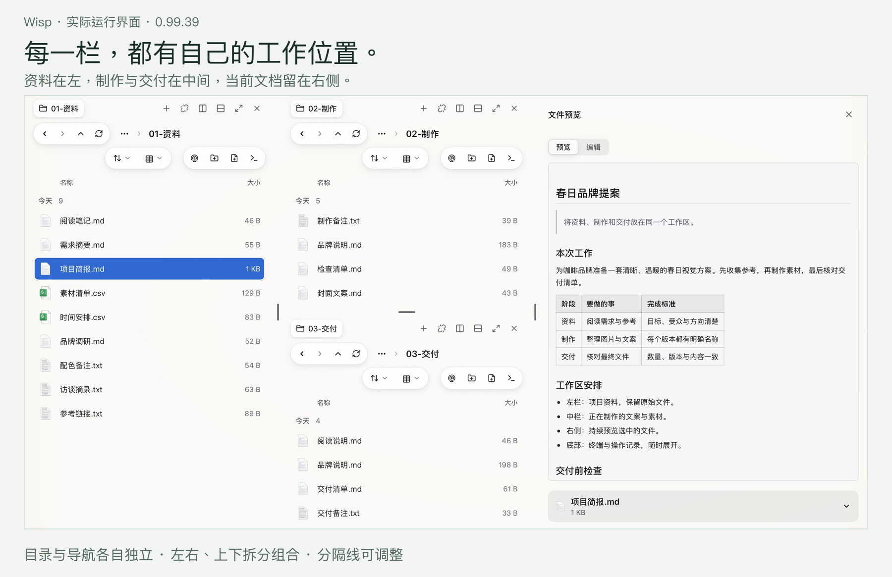
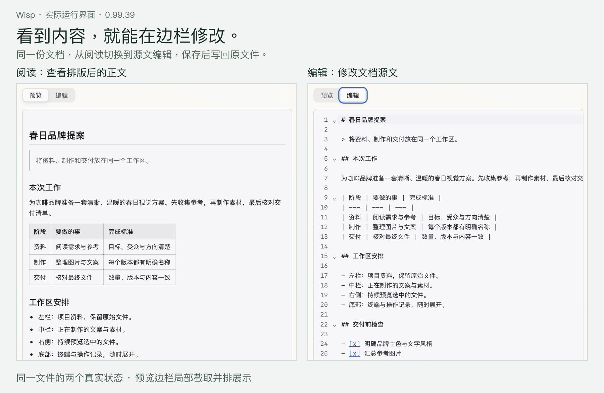
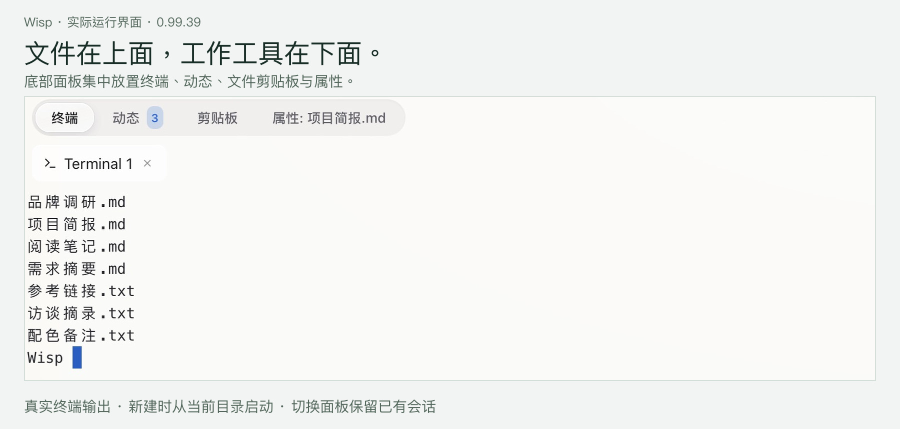

<div align="center">


# Wisp

**把文件夹、文档和工具，放进同一个工作区。**

面向 macOS（苹果桌面系统）的开源文件工作区：独立多窗格、混合标签、持续预览、原地编辑，以及随当前文件夹工作的终端与助手。

**适用于苹果自研芯片的 Mac（苹果电脑）** · [AGPL-3.0（开源许可证）](LICENSE)

**[下载最新版本](https://github.com/xiixiixixi/wisp/releases/latest)** · [查看所有版本](https://github.com/xiixiixixi/wisp/releases) · [反馈问题](https://github.com/xiixiixixi/wisp/issues)

</div>


*工作区总览：把不同位置放进独立窗格，选中的文档留在右侧，底部工具围绕当前工作展开。*

本页图片来自实际运行的 Wisp `0.99.39`，使用演示资料；部分图片由真实界面的局部裁切后拼排，以突出对应功能。[配图来源与维护方法](images/readme/README.md)。

在 Wisp 中，**中间的多窗格负责安排工作，右侧边栏负责读与改，底部面板负责执行和查看结果**。
打开源文件夹、目标文件夹和说明文档，把资料、草稿、网页和比较结果放在同一个窗口里，再按自己的习惯保存布局。

[多窗格与标签](#多窗格与标签让工作并排展开) · [边栏预览与编辑](#边栏预览与编辑选中文件就开始工作) · [文件比较](#文件比较把差异直接放到眼前) · [文档与助手](#文档与助手边读边问边修改)

[底部工具](#底部工具命令记录和文件信息一起工作) · [保存布局](#保存布局让常用工作方式有自己的名字) · [下载安装](#下载安装) · [开发与贡献](#开发与贡献)

## 多窗格与标签：让工作并排展开

### 每一栏都是独立的工作位置

Wisp 的多栏是多个独立窗格。左边可以停在素材目录，右边停在交付目录；
再拆出一个窗格，就可以同时保留参考资料。每个窗格拥有自己的标签、当前位置和前进后退记录。

这与 Finder（访达）的层级列视图是两种不同的能力：层级列视图沿着一条目录路径逐层展开；Wisp 的独立窗格可以同时放下彼此没有上下级关系的目录，甚至不同类型的内容。
Wisp 也提供层级列视图，供需要逐层浏览文件夹时使用。

- **向右或向下拆分。** 在任意窗格继续拆出新窗格，组合左右、上下和更复杂的布局。
- **拖动分隔线。** 给正在阅读的内容更多宽度，给辅助目录留出合适空间。
- **最大化当前窗格。** 临时专注一份文件，再恢复原来的多窗格布局。
- **跨窗格拖放。** 将文件拖到另一个窗格的目录，围绕源位置和目标位置完成整理。
- **独立导航。** 一个窗格切换目录或返回上一层，其他窗格可以保留原来的位置。



*多窗格不是一条展开的目录链：每个区域都能保留自己的位置与标签，左右和上下拆分可以组合使用。*

窗格的目录、标签和导航历史是独立的；**文件视图与排序设置目前由工作区共用**。
这让并排浏览保持一致，也意味着不能给每一栏分别选择不同的排序或显示方式。

### 标签里可以放目录，也可以放工作内容

标签不只代表一个文件夹。一个窗格可以包含目录标签、文本编辑标签、网页标签和文件比较标签。
你可以把项目目录保留在第一个标签，将说明文档和相关网页放在旁边，再让另一个窗格持续显示目标目录。

| 标签类型 | 适合放什么 | 工作时能做什么 |
| --- | --- | --- |
| 目录 | 项目、素材、下载、交付文件夹 | 浏览和选择文件，保留各自的导航位置 |
| 编辑 | 文本、代码、配置、文档源文件 | 在工作区中阅读、修改和保存 |
| 网页 | 参考页面、项目文档、在线资料 | 在标签内打开页面，与本地文件并排查看 |
| 比较 | 两个需要核对的文件 | 将比较结果留在工作区，继续回到目录查找资料 |

在同一窗格内，可以拖动标签调整顺序；右击标签可以固定、复制，或批量关闭一组标签。
要将文本文件打开为编辑标签，在文件列表中右击文件，选择 **编辑**。
网页能否完整显示，取决于网站的登录状态、嵌入限制和页面行为。

### 两种目录联动，适合不同的并排任务

独立浏览适合日常工作；当两个目录之间有对应关系时，可以打开窗格联动。
通过窗格的链条按钮启用或关闭联动，右击链条按钮可切换联动模式。

- **镜像联动：** 两个窗格浏览同一个位置。在一栏进入目录，另一栏跟随到相同路径。
  适合用并排区域查看同一位置，减少重复导航。
- **相对联动：** 为两栏设定不同的起点，之后按相对路径一起前进。
  例如两份项目都包含 `docs/`，在左栏进入该目录时，右栏跟到另一份项目的 `docs/`。
  适合核对结构相近的原始目录、备份目录或不同版本。

**联动的是浏览位置。** 它不会自动复制文件、同步内容或消除两个目录的差异。
对应路径也需要在目标目录中存在；文件传输仍由你明确执行。

### 左侧边栏，把常用位置变成工作入口

左侧边栏提供常用位置、设备、标签和书签入口。书签既可以指向文件夹，也可以指向文件。
文件夹书签还可以作为拖放目标：浏览到一个文件后，直接将它拖到常用目标目录。

目录书签适合固定收件箱、素材库和交付位置；文件书签适合固定一份经常查阅的规范或说明。边栏让这些入口持续可见，独立窗格则让打开后的内容同时留在工作区里。

## 边栏预览与编辑：选中文件，就开始工作

### 预览常驻，文件列表仍在眼前

打开右侧预览后，选中文件就可以查看内容。预览与文件列表并排显示，
你可以继续用方向键换文件，也可以在选中的一组文件间切换，连续审阅一批资料。

按空格可以进入预览；预览入口也在窗口工具栏中。边栏宽度可以调整，
读长文档时给它更多空间，核对小文件时把空间还给目录。



*选中文档后直接在右侧阅读，支持编辑的文件可以在同一位置修改和保存，目录保持可见。*

### 在边栏中修改文本与代码

文本与代码预览默认是只读的。点击编辑后，可以直接修改文件，使用保存按钮或 `⌘S` 写回磁盘。
行号、语法高亮、自动换行、代码折叠和文内查找，帮助你快速定位需要检查的部分。

这适合修改一个配置值、补充一段说明、核对日志、修正脚本或检查生成文件。需要使用外部应用时，也可以按文件关联设置打开文件。

Markdown（标记文档）提供渲染与源文编辑两种方式：阅读时看正文、表格和代码块，
修改时回到源文。切回渲染视图可以检查当前草稿的呈现，代码块也有独立的复制按钮。
保存后的内容写回原文件，未保存内容会显示状态提示。

### 不同文件，用适合它的阅读方式

| 文件类别 | 边栏提供的内容 |
| --- | --- |
| 文本与代码 | 内容阅读、语法高亮、文内查找，支持原地编辑和保存 |
| Markdown（标记文档） | 正文渲染、源文编辑、表格和代码块，代码块可复制 |
| JSON（结构化数据） | 结构化内容查看，便于核对配置与数据 |
| CSV（逗号分隔表格）与电子表格 | 用表格方式查看内容，而非仅显示原始文本 |
| 图片 | 图片显示、缩放和相关信息；部分特殊格式由系统转换支持 |
| PDF（便携式文档） | 在窗口内查看和翻阅文档页面 |
| 音频与视频 | 在边栏中播放支持的媒体文件 |
| 压缩包 | 查看支持格式中的内容，先确认再解压 |
| 办公文档及其他资料 | 查看支持的文字文档、苹果办公文档、电子书、字体、联系人等 |

不同格式的阅读、编辑和转换能力并不相同。办公文档预览不等同于专业排版编辑器；特殊图片、媒体和文档的支持还取决于系统转换能力、文件大小和具体格式。
遇到不支持或过大的文件，界面会说明原因，并保留使用外部应用打开的方式。

## 文件比较：把差异直接放到眼前

选中两个文件，右侧预览会进入比较；在文件列表中选中两个文件后，右击并选择 **比较所选文件**，可以打开独立比较标签。
保留比较结果的同时，仍可在其他标签和窗格查找资料。
两份文件位于不同目录时，可以先标记一份文件，再到另一个目录选中第二份，通过右键菜单与已标记的文件比较。


*文本显示行级差异，图片支持并排与叠加，帮助判断文件的具体变化。*

- **文本比较：** 并排显示两份内容，标出新增、删除与变更，并同步滚动。
  适合配置文件、说明文档、导出文本和代码片段；边栏文本比较每份文件上限为 2 MB（兆字节）。
- **图片比较：** 并排查看，或将两张图片透明叠加并调整透明度。
  适合核对设计稿、截图、修图前后和导出版本；支持格式以比较器实际能够读取的图片为准。
- **文件信息比较：** 对其他文件，比较名称、大小、时间等信息，帮助判断两份文件的关系。

可以交换左右文件，也可以退出比较回到单文件预览。
比较用于观察差异；它不会自动合并文档或覆盖任意一份文件。

## 文档与助手：边读、边问、边修改

### 让问题带着当前文件夹的上下文

右侧聊天面板围绕当前文件夹工作。进入一个项目目录后，可以直接讨论这份项目的文件，
请求读取资料、解释内容、查找文字或提出整理方案。会话历史按文件夹归属保存在本机，
便于回到同一目录继续之前的讨论；主页等位置也可以使用不绑定文件夹的速聊。

助手根据任务通过工具列出、读取或搜索所需内容。工具过程与需要批准的动作会显示在对话中；当前路径提供的是工作起点，具体文件内容在读取后才进入上下文。

### 画布模式：文档与对话一起留在右侧

画布模式将右侧区域分成文档列和对话列。左侧阅读资料，右侧提出问题或修改要求；
文件列表和其他窗格仍然可以作为上下文留在旁边。


*画布布局示例：原文与输入中的问题并排显示；问题尚未发送。*

画布也支持将文档选区引用到对话中，再提交具体要求：

1. 打开文档，在预览中选中一段文字。
2. 点击引用入口，将选中文字和来源文件带入对话；可累积最多 5 段引用。
3. 描述你的要求，例如解释这一段、缩短表述，或只修改引用的部分。
4. 助手需要写文件时，按当前权限模式请求批准或执行。
5. 文件写入后，文档预览重新读取内容，你可以在同一工作区检查结果。

如果预览中仍有尚未保存的手动修改，文件刷新不会直接覆盖这些草稿。
这套流程适合阅读项目说明、润色本地文档、检查输出材料和围绕具体段落讨论问题。

### 可用工具，围绕实际文件工作

助手已连接读取文件、列出目录、按文件名模式搜索、搜索文本内容、提取办公文档文字，
以及创建目录、写文件、改名、复制、移动、移到废纸篓和运行命令等工具。
对于多步任务，还可以创建操作计划，并在批准后执行。

普通文件浏览、预览、编辑、比较和终端使用，都不要求配置助手。需要助手时再连接自己的模型服务，实际能力取决于模型及其工具调用支持。

## 底部工具：命令、记录和文件信息一起工作

底部面板提供终端、动态（操作事件）、剪贴板和属性四个核心入口。它可以收起，也可以调节高度；
上方仍然保留你的目录、文档和右侧工具。



*在文件工作区中运行命令；切换到动态、剪贴板或属性后，已有终端仍然保留进程和输出。*

### 多标签终端

每个终端标签有自己的真实终端进程。新建终端从当前目录启动，
已有终端不会因为你浏览到另一个目录就被重新启动。
切换底部面板也会保留会话与滚动记录，适合运行检查、处理脚本和查看命令输出。

需要外部代码助手时，可以从右侧外部助手面板启动已安装的
Claude Code（克劳德代码助手）、Codex（代码助手）、Gemini（谷歌助手）、
OpenCode（开放代码助手）或自定义命令。它们运行在终端中，面板提供启动与运行状态入口。
相应工具的安装、登录和服务使用，需要按各工具要求自行配置。

### 动态、剪贴板与属性

- **动态（操作事件）：** 将文件活动、通知、变化和撤销记录集中查看，并按类别筛选。
  执行操作后，可以在这里检查过程和结果。
- **剪贴板：** 查看 Wisp 中的文件复制与剪切历史，选择历史项进行粘贴。
  保留当前窗口会话中最近 15 条记录，方便继续之前的文件整理。
- **属性：** 在底部查看所选文件的信息和支持的属性设置，减少独立弹窗对工作区的遮挡。

扩展也可以增加底部标签，让特定工具留在同一个工作区中。

## 保存布局：让常用工作方式有自己的名字

整理素材、阅读资料和处理项目，往往需要不同的窗口安排。
Wisp 可以把当前工作区保存成命名布局，最多保存 10 套，再按任务切换。
按 `⌘⇧L` 打开布局管理，保存并命名当前布局，或选择一套已有布局恢复。

命名布局保留窗格拆分和比例、标签及导航历史、视图设置、外观设置，以及面板展开状态。
例如保存一套“素材整理”，让原始素材与目标目录并排；再保存一套“项目阅读”，
让文档、项目目录和辅助内容保持各自的位置。

**布局保存的是工作区安排。** 终端运行进程、未保存的编辑草稿、助手对话和面板宽度，
不属于命名布局的恢复内容。恢复布局后，仍需按任务重新打开或继续相应工具会话。

外观支持跟随系统、浅色和深色，界面提供简体中文和英文。这些设置服务于阅读与日常工作，也可以与常用布局一起安排。

## 几种适合 Wisp 的工作流

| 你要完成的任务 | 工作区怎么安排 | Wisp 帮你减少的往返 |
| --- | --- | --- |
| 整理素材与交付文件 | 一栏放原始素材，一栏放交付目录，右侧预览当前图片 | 先确认内容，再跨栏拖放；源与目标始终可见 |
| 核对两份项目 | 两栏分别放不同版本，开启相对目录联动 | 进入对应子目录后继续比较文件，不必重复找路径 |
| 阅读并修正文档 | 目录窗格保留资料，右侧打开文档与助手画布 | 引用具体段落提出要求，改后直接检查正文 |
| 检查配置与运行结果 | 配置文件放编辑标签，底部打开终端 | 修改、保存、运行检查和查看结果在一个窗口完成 |
| 查阅本地与在线资料 | 本地文档、目录和网页分配到标签或窗格 | 参考内容留在旁边，减少反复切换窗口 |
| 反复处理同一类任务 | 为每种任务保存命名布局 | 下一次恢复常用的目录、标签与窗格安排 |

### 与 Finder（访达）的关系

Finder（访达）已经提供文件操作、标签、常用位置、层级列视图和预览栏。这些基础能力也是 Wisp 日常浏览的一部分。

Wisp 重点扩展的是**一个窗口如何容纳完整的文件工作**：
独立窗格可以同时保留多个位置，标签可以混合目录、编辑、网页和比较，
右侧工具围绕当前文件展开，底部终端与记录可以持续工作，命名布局让这套安排可复用。

| 你关心的能力 | Wisp 提供的工作方式 |
| --- | --- |
| 同时保留多个工作位置 | 在窗口内部递归拆分独立窗格，调整比例并安排各自的标签 |
| 直接处理文件内容 | 在预览边栏或编辑标签中修改文本，在比较区域核对文件差异 |
| 文件与工具共享上下文 | 当前文件夹可以直接作为终端和助手工作的起点 |
| 恢复常用窗口安排 | 保存与切换命名布局 |
| 增加特定工作工具 | 扩展可以贡献侧栏、底部标签、预览、编辑器和操作入口 |

## 助手配置、权限与数据

### 连接自己的模型服务

在设置中的助手配置里，选择服务或添加自定义服务，填写地址、API key（访问密钥）和模型标识。
Wisp 支持已适配的供应商，也支持使用 OpenAI（模型服务平台）或
Anthropic（模型供应商）兼容协议的服务。

自定义服务可选择 Chat Completions（聊天补全）、Responses（响应接口）或
Messages（消息接口）协议。协议相近不代表工具调用行为完全一致，
是否能执行文件任务还取决于服务和模型的实际支持。

模型菜单显示已配置的模型。你可以在对话面板切换模型和支持的思考档位；
使用本地服务时，同样需要先配置可用的地址与模型。
Wisp 不附带模型订阅，也不会在未配置时自动提供可调用的模型。

### 由你决定何时执行操作

默认权限模式会在文件修改、命令执行和外部工具调用前请求批准。
可以允许一次、允许相应工具继续执行，或拒绝；工具活动与批准请求显示在对话中。
选择完全访问模式后，工具可以直接执行，适合你已经理解任务和访问范围的工作。

Agent Skills（助手技能）可以提供本机保存的任务说明；MCP（模型工具连接协议）可以接入额外工具服务器。
二者需要各自的配置，服务器不可用时不会阻止继续使用内置文件工具。

### 文件与对话数据去哪里

- 浏览、预览和编辑操作在本机完成，不需要先上传文件到模型服务。
- 使用助手时，问题、上下文以及工具为任务读取的文件内容，会发送到你配置的模型服务。
- 会话历史保存在本机；这不改变模型供应商对收到的数据所适用的政策。
- 外部代码助手、工具服务器和桥接服务，按各自的配置与权限访问和处理数据。

右侧工具菜单还提供 ChatGPT（对话人工智能）桥和微信桥。
ChatGPT（对话人工智能）桥需要隧道客户端、连接配置和允许共享的目录，提供只读文件访问；
微信桥需要完成连接与配对，并设置相应工作范围。
这些连接是可选能力，具体配置完成前不会成为可用的远程工作入口。

## 扩展与日常文件操作

### 扩展，让特定工具进入工作区

扩展可以增加侧栏面板、底部标签、文件预览、编辑器、右键操作和命令。
Wisp 支持本地扩展加载；仓库提供公开接口、扩展项目生成工具与示例，供开发者构建自己的工作工具。

仓库包含 Git（版本管理）等扩展源码。安装并启用相应扩展后，
可以在底部查看变更和历史、文件差异、暂存与取消暂存、提交、切换分支、获取远端信息和推送。
扩展源码存在于仓库，并不意味着每个发布版本默认安装了所有扩展。

扩展通过声明的权限与应用接口使用文件和工具能力。
安装时应查看它请求的权限，选择可信来源；扩展接口的权限限制不等同于独立进程的安全隔离。

### 基础能力，支撑完整工作流

Wisp 提供复制、移动、重复、改名、新建文件和文件夹、移到废纸篓，以及支持的撤销与重做。
批量重命名有实时预览，支持文字与正则替换、序号和日期，并提示重名冲突。
支持格式的压缩与解压、传输进度、文件关联、隐藏文件显示和标签，也可在日常整理中使用。

搜索入口支持文件名搜索、文件与文件夹筛选、最近访问项和直接路径。
macOS（苹果桌面系统）名称搜索使用 Spotlight（系统文件索引）；
结果覆盖范围取决于系统索引、磁盘和访问权限，当前列表最多显示 50 项。
助手的内容搜索属于另一种按任务读取文本的能力。

文件夹内还可以选择图标、列表、详细信息、树状、图库和层级列等显示方式。
视图选择改变文件的呈现，独立窗格与边栏工具则决定如何安排整项工作。

## 下载安装

当前提供面向 macOS（苹果桌面系统）、Apple silicon（苹果自研芯片）的磁盘映像安装包。

1. 打开[最新版本下载页](https://github.com/xiixiixixi/wisp/releases/latest)。
2. 下载名称包含 `aarch64` 的 `.dmg` 文件。
3. 打开安装包，将 Wisp 拖入应用程序文件夹，再启动应用。

后续更新可以在 **设置 → 通用 → 关于** 中检查、下载并安装。发布内容、安装文件和版本说明，以对应版本页面为准。

### 常用快捷键

下表为 macOS（苹果桌面系统）默认绑定；可在设置中的快捷键页面查看和修改。
键盘焦点位于编辑器或终端时，相关文字编辑快捷键由该工具处理。

| 快捷键 | 动作 |
| --- | --- |
| `⌘P` / `⌘F` | 打开文件与文件夹搜索 |
| `⌘⇧G` | 输入目录路径 |
| `⌘T` / `⌘W` | 新建标签 / 关闭当前标签 |
| `⌘\` / `⌘⇧\` | 向下拆分 / 向右拆分当前窗格 |
| `⌘⇧P` | 展开或收起预览边栏 |
| `⌘J` | 展开或收起底部面板 |
| ⌘ + 反引号 | 打开终端 |
| `⌘⇧L` | 打开工作区布局管理 |
| `⌘B` | 打开路径书签管理 |
| 空格 | 预览选中文件 |
| `⌘1` / `⌘2` / `⌘3` / `⌘4` | 图标 / 详细列表 / 层级列 / 图库 |
| `⌘⇧.` | 显示或隐藏隐藏文件 |
| `⌘Z` / `⌘⇧Z` | 撤销 / 重做支持的文件操作 |
| `⌘/` | 查看快捷键说明 |
| `⌘,` | 打开设置 |

## 开发与贡献

### 从源码运行

桌面界面使用 React（界面库）19、TypeScript（带类型的脚本语言）和 Vite（前端构建工具），本机能力由 Tauri（桌面应用框架）2 与 Rust（系统编程语言）提供。
仓库使用 pnpm（包管理工具）组织多个应用与包。

需要 macOS（苹果桌面系统）、Xcode Command Line Tools（苹果命令行开发工具）、
Node.js（脚本运行环境）22.19 或以上、pnpm（包管理工具）11，以及 Rust（系统编程语言）工具链。
`rust-toolchain.toml` 固定工具链版本为 `1.91.1`；当前助手依赖要求的运行环境高于根目录 `engines` 和 `.nvmrc` 中仍保留的版本。
系统开发工具安装步骤见 [Tauri（桌面应用框架）本机开发环境说明](https://v2.tauri.app/start/prerequisites/#macos)。

```bash
git clone https://github.com/xiixiixixi/wisp.git
cd wisp
pnpm install --frozen-lockfile
node scripts/sync-pdf-worker.mjs
pnpm dev:app
```

`sync-pdf-worker.mjs` 对齐 PDF（便携式文档）预览所需的后台解析文件。
`pnpm dev:app` 启动本地界面与桌面窗口；真实文件操作和系统预览需要桌面运行环境。
`pnpm dev` 还会启动独立市场服务，开发桌面界面本身不必同时运行该服务。

### 目录与职责

| 路径 | 内容 |
| --- | --- |
| `apps/client/` | 桌面界面、窗格、预览、设置与前端测试 |
| `apps/src-tauri/` | 本机文件操作、系统集成、终端和桌面配置 |
| `packages/sdk/` | 供界面使用的应用服务层 |
| `packages/extension-sdk/` | SDK（扩展开发工具包）与公共扩展接口 |
| `packages/create-extension/` | 扩展项目生成工具 |
| `packages/extensions/` | 扩展源码，上游子模块 |
| `packages/cli/` | 命令行入口 |
| `apps/web/` | 独立的网页与扩展市场服务 |

### 构建与检查

```bash
# 生成桌面程序，不打包安装器
pnpm tauri:build --no-bundle

# 类型、代码规范与相关测试
pnpm exec tsc --noEmit
pnpm lint
pnpm exec vitest run apps/client/src/__tests__/lib/preview-factory.test.ts

# 按范围运行后端测试，以压缩功能为例
cargo test --manifest-path apps/src-tauri/Cargo.toml compression

# 生成包含安装包的构建
pnpm build
```

根据改动选择对应的测试文件和后端测试范围。
前端测试使用 Vitest（测试工具），后端使用 Rust（系统编程语言）测试；真实文件、系统预览和终端行为，应在桌面应用中再检查实际结果。

### 开发扩展

```bash
# 拉取仓库中的扩展子模块
# 仅在需要开发这些扩展时执行
git submodule update --init packages/extensions

# 生成一个新的扩展项目
node packages/create-extension/bin/index.js my-extension

# 构建现有扩展；开发时监听源码变化
pnpm extensions:build
pnpm extensions:dev
```

扩展可以按所需能力选择预览、编辑器、工具面板或文件操作入口，并声明相应权限。
接口与示例见 [`packages/extension-sdk/`](packages/extension-sdk/)。
市场服务的数据库、环境变量和计费配置属于独立开发任务，不是运行桌面应用的前提。

### 反馈与参与

欢迎通过 [GitHub Issues（问题反馈）](https://github.com/xiixiixixi/wisp/issues) 提交问题和改进建议，
或向 [Wisp 仓库](https://github.com/xiixiixixi/wisp) 提交范围明确的 Pull Request（合并请求）。

反馈时请附上应用版本、系统版本、复现步骤，以及预期和实际行为。涉及布局或预览时，一张能说明问题的截图很有帮助；示例文件请移除私人内容。
修复和新增功能应说明用户会看到什么变化，并附上与改动相关的验证结果。

## 上游与许可

Wisp 基于 [Xplorer（上游文件管理器）](https://github.com/kimlimjustin/xplorer) 分支开发，
上游由 Justin Maximillian Kimlim（上游作者）及贡献者创建。
扩展子模块来自 [xplorer-extensions（上游扩展仓库）](https://github.com/kimlimjustin/xplorer-extensions)。

主项目遵循 [AGPL-3.0（开源许可证）](LICENSE)。
具体条款请查看许可文件；各包和第三方依赖保留各自的许可与作者声明。
