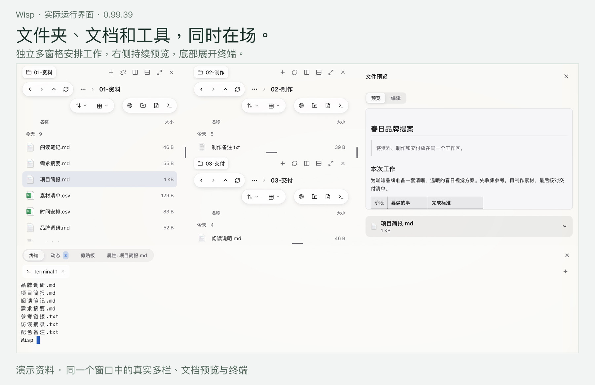
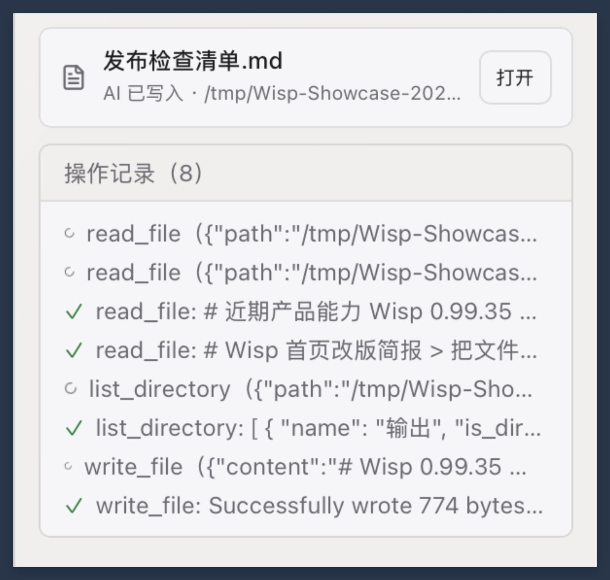
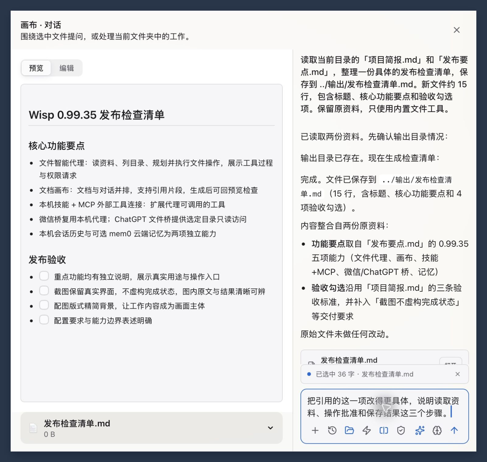
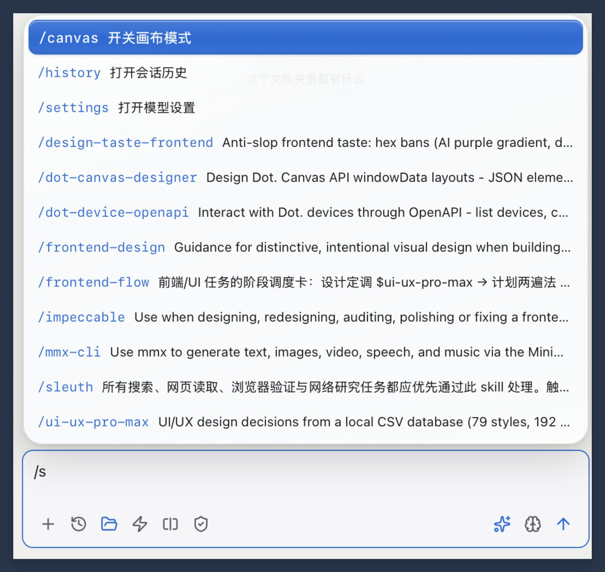
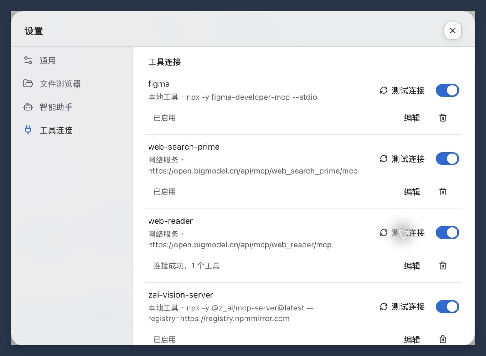
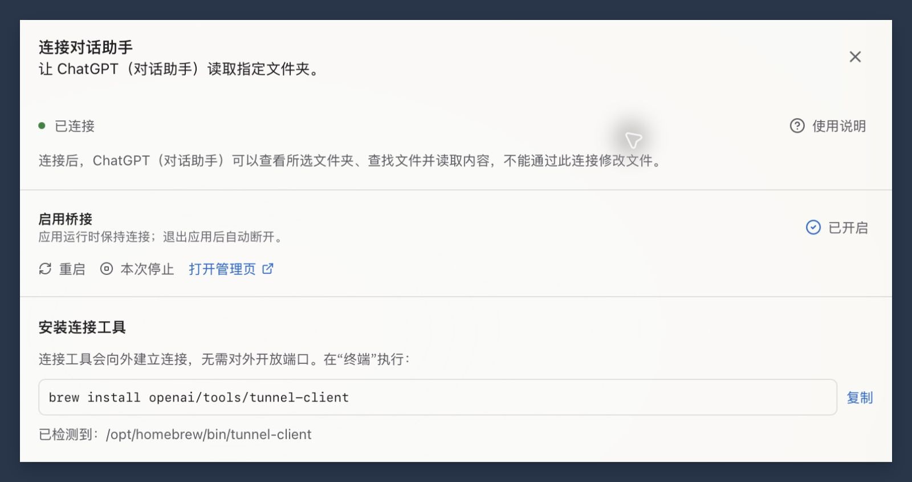
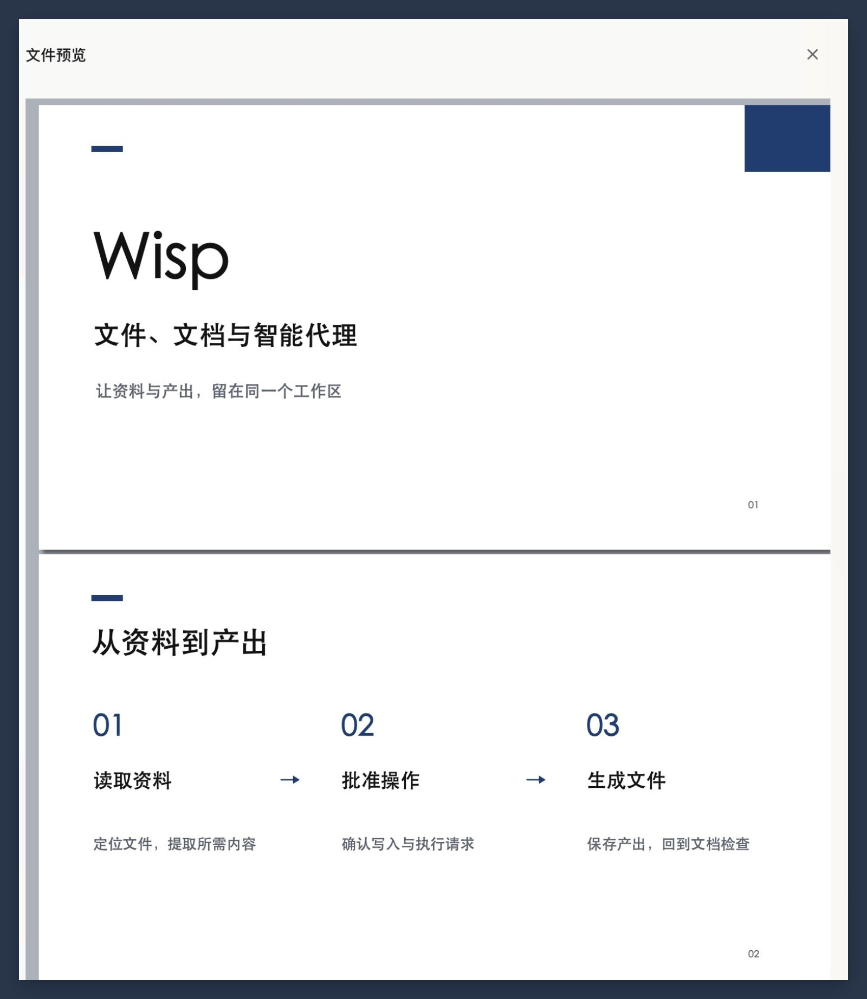

<div align="center">


# Wisp

**独立多栏浏览 · 文档画布与编辑 · 文件智能代理**

面向 macOS（苹果桌面系统）的开源文件智能工作区。
把资料、参考文件和产出并排打开，让助手读取文件、执行任务，再直接查看和修改生成的文档。

**Apple silicon（苹果自研芯片）** · **[AGPL-3.0（开源许可证）](LICENSE)**

**[下载最新版本](https://github.com/xiixiixixi/wisp/releases/latest)** · [版本记录](https://github.com/xiixiixixi/wisp/releases) · [反馈问题](https://github.com/xiixiixixi/wisp/issues)

</div>



*同一目录的完整应用窗口：左图为浅色主题，右图为深色主题，两张均未裁切，保留顶栏、左侧导航、单一文件目录和底部状态栏。*

文件工作通常要在几份资料、多个目录和一份正在修改的结果之间来回切换。
Wisp 把这些位置放在同一个窗口：中间的独立多栏安排资料与产出，右侧画布阅读和编辑文档，助手围绕本机文件完成获准的任务。

从读取会议记录、汇总待办，到生成清单、引用段落继续修改，工作可以在文件目录和实际文档之间连续进行。
本机技能、项目规则和 MCP（外部工具连接）可以扩展这套流程；微信、ChatGPT（对话助手）文件桥与外部编程助手提供不同的接入方式。

[多栏工作区](#多栏工作区让资料参考和产出各有位置) · [文件智能代理](#文件智能代理读取资料规划任务执行操作) · [文档画布](#文档画布生成阅读引用和修改)

[技能与规则](#技能与项目规则复用自己的工作方法) · [工具连接](#mcp外部工具连接把已有服务接进任务) · [会话与记忆](#本机会话与可选云记忆)

[微信](#微信在手机上安排任务和批准操作) · [ChatGPT（对话助手）文件桥](#chatgpt对话助手文件桥按需读取本机资料) · [外部助手](#外部助手在工作区继续已有项目会话) · [下载安装](#下载安装)

## 多栏工作区：让资料、参考和产出各有位置

### 多个独立目录，组成一项工作

每个文件窗格都有自己的标签、当前位置和前进后退记录。
左栏可以停在原始资料，另一栏打开交付目录；再拆出一个位置，保留需要对照的说明或其他版本。
在其中一栏进入子目录，其他栏仍保留自己的位置。

这些窗格可以打开彼此没有上下级关系的目录，适合同时安排来源、目标和参考资料。
Finder（访达）的层级列视图沿一条目录路径展开；Wisp 也提供层级列视图，供逐层浏览时使用。

通过窗格的拆分入口选择向右或向下拆分，可以组合左右与上下布局。
拖动分隔线调整比例，临时最大化正在使用的窗格，再恢复原有布局。
默认 `⌘\` 向下拆分，`⌘⇧\` 向右拆分；视图和排序由工作区共用。

例如撰写一份报告，可以这样安排：

- **资料栏：** 保留原始文档，检查代理需要读取的材料。
- **参考栏：** 查看写作规则、上一版报告或相关网页。
- **产出栏：** 保留交付目录，查看刚生成和修改的文件。
- **右侧画布：** 阅读当前文档，选中段落继续提出修改要求。

将文件拖到另一个窗格的目录即可整理来源与产出；悬停会激活目标窗格。
拖放可使用修饰键选择复制、移动或建立符号链接，同名文件通过冲突提示处理。

### 目录、编辑、网页和比较成为标签

右击文本文件选择 **编辑**，可以在独立标签中阅读、修改和保存。
目录标签旁边也可以保留网页与文件比较标签；在同一窗格中拖动标签排序，右击即可固定、复制或关闭一组标签。

选中两个文件，右击选择 **比较选中文件**，把结果留在独立比较标签。
跨目录比较可以先标记一个文件，再到另一个位置选择待比较文件。
当前目录中选中两个文件时，持续预览边栏也可以进入比较。

### 联动导航，保存常用安排

点击窗格的链条按钮启用导航联动，右击按钮在镜像与相对模式间切换。
镜像模式跟随到相同路径；相对模式从不同起点沿对应结构浏览，适合两份都包含 `docs/` 等目录的项目。
导航联动改变浏览位置，文件复制与内容同步仍由实际文件操作完成。

按 `⌘⇧L` 打开工作区布局管理，命名保存、加载、重命名和删除常用布局，最多保存 10 份。
布局包含窗格结构、标签、导航位置和比例，以及相关视图、主题和展开状态。
终端运行和聊天会话分别管理，适合为“整理资料”“核对版本”“撰写报告”保留不同安排。

## 文件智能代理：读取资料、规划任务、执行操作

Wisp 内置基于 pi（文件智能代理引擎）的助手，可以直接使用本机文件工具。
提出目标后，代理可以查看目录、读取资料、查找内容、生成文档，再按批准的范围执行文件操作。

### 配置模型，从当前文件夹开始

打开 **设置 → 智能助手**，在模型服务区域填写服务地址、API key（接口密钥）和模型。
接口类型支持 OpenAI（模型服务）兼容格式与 Anthropic（克劳德模型服务）兼容格式，按所用服务选择。
已有 `~/.pi/agent/models.json` 和认证配置也可以用于模型设置。

然后打开工具栏菜单中的 **对话**，选择模型，再决定任务模式。
**文件夹模式**围绕当前真实目录组织任务与历史；**快速模式**适合翻译、解释和即时起草，保留独立会话。
输入框可以选择模型及其支持的思考强度：自动、关闭、低、中、高。

任务可以明确资料范围、处理标准和产出位置，例如：

> 读取这个目录中的会议记录，整理尚未完成的事项，按负责人分组，把清单写到 `deliverables/action-items.md`。

代理可以列出目录、读取文本、按模式寻找文件、搜索正文，并提取支持的办公文档文字。
PDF（便携文档）、Word（文字文档）、Excel（电子表格）和 PowerPoint（演示文稿）等资料可以参与文本汇总与分析。
扫描页、图片与特殊排版需要相应的内容提取能力。

### 从分析走到实际文件产出

代理具备创建目录、创建或改写文件、重命名、移动、复制和移到废纸篓等工具。
需要进一步处理时，可以运行命令并指定工作目录；多步骤任务可以先创建执行计划，再依次完成计划中的操作。

可以先让代理说明安排，确认文件位置和目标后执行，再查看工具活动和返回结果。
例如先找出需要整理的资料，再按规则建立目录、调整文件名，最后生成一份说明文档。
过程中可以停止，完成后可以继续补充要求，围绕同一任务做下一轮处理。



*实际任务的操作记录：读取两份资料、检查目录，再写入发布检查清单。*

文件修改、命令、计划执行与外部工具默认需要批准，提供 **允许一次、始终允许、拒绝**。
输入框也可主动切换全权限；当前目录提供任务上下文，实际访问仍受本机路径与命令规则约束。
多步操作已经完成的修改不会因停止自动回滚，重要整理任务可先要求计划，再逐步批准。

输入 `/` 可使用 `/canvas` 打开画布、`/new` 新建会话、`/history` 查看历史，
`/folder` 切换文件夹模式、`/quick` 切换快速模式、`/settings` 打开设置。
本机发现的技能也会出现在同一个斜杠菜单中。

## 文档画布：生成、阅读、引用和修改

画布把右侧展开为 **文档预览 + 对话**，让文件内容与修改要求并排出现。
代理生成文件后可以接着阅读，找到需要调整的段落，再继续对话。



*文档留在左侧，对话保留在右侧；选择文字后，可以把具体段落加入下一次提问。*

### 生成的文档自动回到工作区

让代理把结果写成 Markdown（标记文档）或纯文本文件，批准写入后，支持的产出会自动进入画布。
例如读完资料生成 `summary.md`，接着就在画布中检查标题、段落和待办，再提出下一轮调整。
当前自动打开后缀为 `md`、`markdown`、`txt`、`text`；其他文件可通过列表和对话文件入口打开。

对话中的文件入口可以重新打开产出，输入框的画布按钮和 `/canvas` 也能把选中文件与对话并排放置。
产出目录继续留在其他窗格，便于查看文件是否写到预期位置，并与参考资料对照。

### 引用原文，明确要修改的部分

在支持选区引用的文档预览中，选择文字，点击浮出的 **引用** 按钮。
Wisp 会打开画布，将原文和文件路径加入待发送引用，光标回到输入框。
接着可以要求“压缩到两句话”“改成清晰的操作步骤”，或对照另一份材料核对这段结论。

可以收集多段引用后统一提出要求，最多保留 5 段，每段 2–4000 个字符。
引用、文件路径和要求会一起保存在会话消息中，便于后续继续核对和修改。
需要保留其他内容时，可以在要求中明确修改范围，再查看文档或文件差异。

### 手动编辑和代理修改接着做

Markdown（标记文档）和 HTML（网页文件）等预览提供渲染与源码编辑状态，文本、代码和配置文件也可编辑保存。
可以先手动改一处，再让代理处理另一段；也可以从文件右键菜单打开独立编辑标签。
文档保留原来的文件位置，资料、参考与输出窗格继续服务于同一项工作。

## 技能与项目规则：复用自己的工作方法

### 本机 Skills（技能）

将反复使用的流程、判断标准和产出要求写成技能，之后就可以在任务里点名使用。
例如为周报规定结构，为资料归档规定命名，为文档检查规定核对步骤。

Wisp 会发现 `~/.agents/skills` 和 `~/.pi/agent/skills` 中的技能，通过各技能目录的 `SKILL.md` 读取名称、简介与说明。
已有符合这一结构的本机技能可以继续使用，同名技能优先采用前一个目录中的版本。



*输入 `/` 查看本机技能，选择一个流程后，补充这次要处理的文件与目标。*

代理会根据技能简介判断适用场景，按需加载完整说明；用户也可以从斜杠菜单直接指定。
技能安排工作步骤，文件工具和已配置的 MCP（外部工具连接）提供执行能力。
技能使用的脚本、依赖与服务按相应说明准备。

### 项目约定随目录生效

用户主目录内的项目及上级目录中的 `AGENTS.md`、`CLAUDE.md` 可以提供命名规则、文档风格、输出位置和检查要求。
创建文件夹会话时，代理读取适用的目录链说明，把这些约定带进任务。

例如规则写明“报告放入 `deliverables/`，每个结论列出资料文件名”，进入这个项目后即可围绕同一套要求工作。
这样既可复用通用技能，也可让不同项目保留自己的习惯。

## MCP（外部工具连接）：把已有服务接进任务

通过 MCP（外部工具连接），文件代理可以使用用户配置的服务工具。
例如从资料检索服务获取信息，查询数据库，或调用自动化服务提供的操作，再结合本机文件生成结果。

打开 **设置 → 工具连接**，添加服务名称，再选择本地或远程连接。
本地服务填写启动命令、参数和环境变量；远程服务填写 HTTP（网络请求）地址及所需请求头。
已有配置也可保存于 `~/.pi/agent/mcp.json`，通过 `mcpServers` 列表管理。



*工具连接设置：网页阅读服务连接成功，发现 1 项工具；可测试、启停和编辑配置。*

点击 **测试** 查看连接结果和发现的工具数量，启用后在新建代理会话中使用。
任务需要外部信息或操作时，代理会选择相应工具，用户查看调用与参数后批准。
例如从已接入的网页阅读服务获取资料，再要求代理整理成工作目录中的说明。

可随时启用、停用、编辑或删除连接。
本地程序需可运行，远程服务需可访问并具备有效认证；实际能力由所连接服务提供。

## 本机会话与可选云记忆

文件夹模式的对话按目录组织，快速模式保留独立会话。
点击输入框的 **历史** 查看最近任务，恢复一项会话继续工作，或删除不再需要的记录。
新建会话用于独立任务，恢复会话让此前对话继续进入代理上下文。

如果希望跨会话使用长期偏好与背景，可以选择配置 mem0（云记忆）。
记忆设置位于 **设置 → 智能助手**，需要联网及有效的 API key（接口密钥）和用户标识。
配置并启用后，发送任务前会检索相关记忆；开启自动记录后，用户消息和助手答复会发送给服务提炼记忆。


*自动记忆开关与数据发送说明；个人档案和记忆内容已裁出配图。*

用户标识决定使用哪组记忆，可以关闭自动记录或整个功能。
本机会话保存当前任务的对话，云记忆提炼信息供以后检索；启用自动记录会将相关对话发送到云端。
使用前先完成服务配置并确认状态，本机会话与窗格布局仍分别管理。

## 微信：在手机上安排任务和批准操作

微信桥把消息接到电脑上运行的文件代理，手机上可以继续提出任务、接收回复和批准操作。
连接使用 iLink（微信机器人连接），电脑需要保持运行、Wisp 打开且网络可用。

打开工具栏菜单中的 **微信机器人**，按提示扫码绑定，必要时填写验证码。
添加当前目录、选择文件夹或输入绝对路径，安排可切换的工作位置。


*微信桥的回复详细程度与工作文件夹设置。*

绑定后发送文字任务，例如“检查交付目录缺少哪些说明文件”，或“根据今日记录生成进展草稿”。
代理使用电脑上已配置的模型和对应工作目录，回复返回微信。

需要批准时，微信会收到工具与参数摘要，回复 **允许** 或 **拒绝** 即可选择，等待时限为 90 秒。
运行中可用 `/stop` 停止；`/ws` 查看工作目录，`/ws 1` 切换到列表中的目录。
`/new` 开始新会话，`/status` 查看状态，`/help` 查看命令说明。

切换目录会开始对应的新会话，已有会话按聊天对象保存。
回复可选择只发最终答复、发送阶段答复，或连工具活动一起通知；面板提供解绑与已有连接恢复。
当前任务输入以文字和已有语音转录为主，图片、视频与文件消息提供附件元信息。

## ChatGPT（对话助手）文件桥：按需读取本机资料

文件桥让 ChatGPT（对话助手）按需读取选定的本机目录，便于围绕已有文字资料继续提问。
通过 OpenAI Secure MCP Tunnel（OpenAI 安全工具连接隧道），Wisp 启动和管理本机连接。

打开工具栏菜单中的 **连接对话助手**，按说明准备官方隧道客户端和账户侧的接入条件。
填写隧道标识、API key（接口密钥）和客户端位置，选择允许读取的目录，保存后启用。
目录可通过文件夹选择器添加，也可以直接加入当前文件夹。



*只读文件桥的运行状态与启停入口；账户配置位于面板下方。*

提供 **读文件、列目录、按文件名查找、查看文件信息** 四项只读能力。
例如先找到某份说明，再读取其文字，围绕内容讨论；读取范围由选定目录控制。
文件桥还会检查实际路径与符号链接，过滤部分敏感文件，密钥保存在本机钥匙串。

这条连接只读本机资料，文件修改和命令执行可以回到 Wisp 文件代理完成。
读取返回有限长度的文本；办公文档文本提取可使用 Wisp 的内置代理工具。
账户侧工具接入、网络和隧道需完成配置，面板提供启用状态、重启、停止及后续连接恢复。

## 外部助手：在工作区继续已有项目会话

打开工具栏菜单中的 **外部助手**，检查本机程序，再选择助手在当前真实目录中启动。
支持 Claude Code（克劳德编程助手）、Codex（OpenAI 编程助手）、OpenCode（开放编程助手）、
Gemini CLI（谷歌命令行助手）以及自定义命令。
命令行交互在 Wisp 内置终端中展开，文件窗格与参考文档可以持续保留。

### 从已有项目历史继续

面板读取当前目录对应的 Claude Code（克劳德编程助手）和 Codex（OpenAI 编程助手）本机历史。
在其他终端中开始的项目会话也可以列出，找到任务后点击恢复，使用相应助手自己的继续会话命令。
项目文件、参考资料和已有对话因此可以在同一个工作区接着使用。

面板也会识别支持的终端助手，显示运行提示与输出中提到的文件，便于回到相关目录查看。
普通内置终端中自行启动的助手也可提供运行线索。

本机程序需要先安装并完成各自的登录或模型配置，面板可复制安装命令。
已有历史仍由对应助手管理；恢复会话目前覆盖 Claude Code（克劳德编程助手）与 Codex（OpenAI 编程助手）。

## 文档与特殊预览：在工作区持续阅读

选择文件，右侧即可持续显示预览；键盘切换文件时，内容随选择更新。
默认空格预览选中文件，`⌘⇧P` 展开或收起边栏，多栏中的资料与目录仍保留在原位。



*演示文稿在原生持续预览中显示完整页面，直接阅读下一页的内容。*

### 原生文档与完整演示页面

macOS（苹果桌面系统）上的 PDF（便携文档）使用原生连续页阅读，适合查看长报告。
Word（文字文档）使用系统文档预览，保持文档阅读体验。
PowerPoint（演示文稿）优先显示系统生成的完整页面，可以继续查看后续内容；系统预览不可用时提供缩略图与提取文本。
具体显示能力随文件格式与系统预览支持而变化。

### 文本、网页与图像

Markdown（标记文档）可在渲染与源码之间切换，HTML（网页文件）支持静态渲染、源码编辑和未保存草稿预览。
已保存网页会解析相邻的样式与图片，页面脚本被禁用，便于检查静态内容与修改结果。
文本、代码和配置文件可以直接编辑保存，再由代理或手动继续处理。

HEIC（高效图像格式）、RAW（相机原始图像）与 PSD（图像编辑文件）等系统可转换图像也可预览。
大于 10 MB（兆字节） 的图片会先缩小到预览分辨率，降低超大位图的内存压力。
电子表格、EPUB（电子书）、字体、压缩包、属性列表和联系人文件也提供相应预览入口，便于快速检查内容。

<details>
<summary><strong>日常文件管理与底部工具</strong></summary>

Wisp 提供复制、移动、重复、重命名、新建文件与文件夹、移到废纸篓，以及支持的撤销与重做。
批量重命名支持文字和正则替换、序号、日期，提供结果预览与重名提示；压缩、解压与文件传输也有对应入口。

左侧保留常用位置、书签、磁盘、标签与废纸篓。
文件夹内可切换图标、列表、详细信息、树状、图库和层级列等视图。
名称搜索使用 Spotlight（系统文件索引），可筛选文件或文件夹、访问最近项目和输入路径，当前列表最多显示 50 项。

按 `⌘J` 展开或收起底部面板，默认 ⌘ 加反引号打开终端。
事件记录、剪贴板历史和文件属性提供补充信息，外部助手也在内置终端中继续交互。

常用快捷键：`⌘P` / `⌘F` 搜索，`⌘⇧G` 输入路径，`⌘T` / `⌘W` 新建或关闭标签，
`⌘⇧.` 显示隐藏文件，`⌘Z` / `⌘⇧Z` 撤销或重做支持的操作，`⌘,` 打开设置。
默认绑定可在设置中查看和修改，编辑器与终端按当前键盘焦点处理文字操作。

</details>

## 下载安装

当前提供 macOS（苹果桌面系统）、Apple silicon（苹果自研芯片）的磁盘映像安装包。

1. 打开[最新版本下载页](https://github.com/xiixiixixi/wisp/releases/latest)。
2. 下载名称包含 `aarch64` 的 `.dmg` 文件。
3. 打开安装包，将 Wisp 拖入应用程序文件夹，再启动。

后续更新在 **设置 → 通用 → 关于** 中检查、下载并安装，以对应发布页为准。
文件代理使用前配置模型；微信和文件桥按各自面板说明完成连接。

## 开发与贡献

界面使用 React（界面库）19、TypeScript（带类型的脚本语言）与 Vite（前端构建工具），
本机能力使用 Tauri（桌面应用框架）2 和 Rust（系统编程语言），仓库使用 pnpm（包管理工具）。
需要 macOS（苹果桌面系统）、Xcode Command Line Tools（苹果命令行开发工具）、Node.js（脚本运行环境）22.19 或以上及相应工具链。
Rust（系统编程语言）版本由 `rust-toolchain.toml` 固定为 `1.91.1`，当前代理依赖的运行环境要求高于根目录保留的旧声明。
开发环境准备见 [Tauri（桌面应用框架）文档](https://v2.tauri.app/start/prerequisites/#macos)。

```bash
git clone https://github.com/xiixiixixi/wisp.git
cd wisp
pnpm install --frozen-lockfile
node scripts/sync-pdf-worker.mjs
pnpm dev:app
```

同步脚本对齐 PDF（便携文档）相关解析文件；`pnpm dev:app` 启动界面和桌面窗口。
本机文件、系统预览与终端在桌面环境中运行，`pnpm dev` 还会启动独立市场服务。

```bash
# 构建桌面程序，不打包安装器
pnpm tauri:build --no-bundle
# 类型、规范与按功能选择的测试
pnpm exec tsc --noEmit
pnpm lint
pnpm exec vitest run apps/client/src/__tests__/lib/preview-factory.test.ts
cargo test --manifest-path apps/src-tauri/Cargo.toml compression
# 构建界面、桌面程序与安装包
pnpm build
```

前端测试使用 Vitest（测试工具）；文件操作、系统预览、连接与终端还应检查桌面中的实际结果。
界面与本机功能分别在 `apps/client/` 和 `apps/src-tauri/`，扩展接口见 `packages/extension-sdk/`。

```bash
# 需要开发上游扩展时拉取子模块
git submodule update --init packages/extensions
# 生成扩展项目、构建或监听变化
node packages/create-extension/bin/index.js my-extension
pnpm extensions:build
pnpm extensions:dev
```

扩展可提供预览、编辑器、工具面板和文件操作入口，并声明所需权限。
`apps/web/` 是独立网页与扩展市场服务，其数据库和计费配置与桌面开发分别管理。
欢迎通过 [GitHub Issues（问题反馈）](https://github.com/xiixiixixi/wisp/issues) 报告问题，或提交 Pull Request（合并请求）。
请附版本、复现步骤、预期与实际行为，以及相关验证；示例文件、日志和连接配置请移除私人资料与密钥。

## 上游与许可

Wisp 基于 [Xplorer（上游文件管理器）](https://github.com/kimlimjustin/xplorer) 分支开发，上游由 Justin Maximillian Kimlim（上游作者）及贡献者创建。
扩展子模块来自 [xplorer-extensions（上游扩展仓库）](https://github.com/kimlimjustin/xplorer-extensions)。
主项目遵循 [AGPL-3.0（开源许可证）](LICENSE)，各包与第三方依赖保留相应许可和作者声明。
